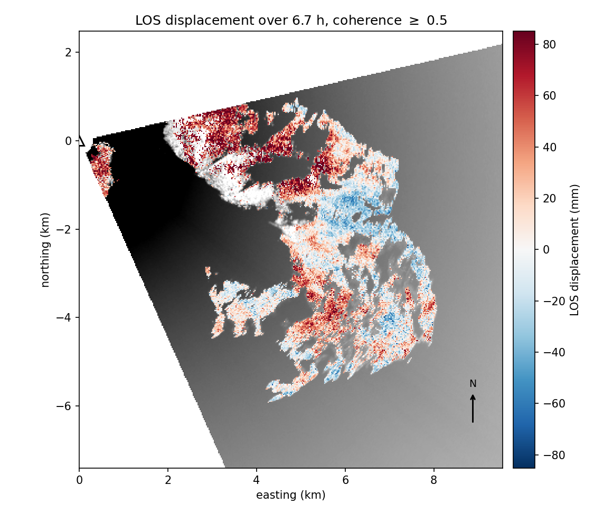
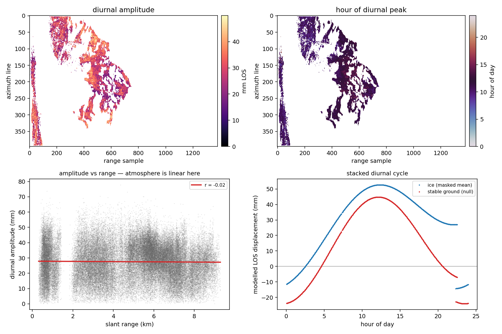
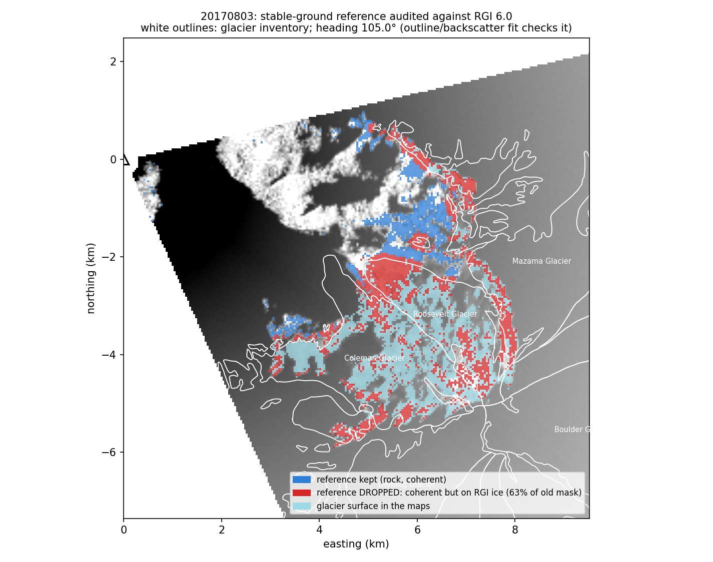

# GPRI

Scripts and figures for processing and understanding GAMMA terrestrial radar
interferometric data.

This repository turns GAMMA's interferogram products into **line-of-sight
displacement time series on a map**, for GPRI-II ground-based radar. It reads
GAMMA's `.diff` / `.cc` rasters and `SLC_tab` / `itab` tables directly and does
not need the GAMMA binaries — which matters, because the processing host has
no GAMMA installation or license.



*LOS displacement over 6.7 hours on the north side of Mount Baker, from 200
consecutive BakerBend1 interferograms, projected to a local stereographic
frame. Backdrop is mean backscatter; areas below coherence 0.5 are masked —
beyond about 8 km the beam is in shadow behind the mountain.*

## What it does

```
gamma/         read GAMMA parameter files and binary rasters
network/       epochs, pairs, SBAS design matrices, closure triplets
stack/         patch-wise access to a whole diff0 directory (50 GB, memory-mapped)
covariance/    sample coherence matrices
phaselink/     EVD, eigenSAR, EMI and exact ML phase linking
atmosphere/    range-dependent refractivity screens, estimated on wrapped phase
refractivity/  the same screens from meteorology, and per-epoch N
closure/       closure-phase bias estimation and correction
psinterp/      PS-interpolation unwrapping over decorrelated ground
timeseries/    network inversion, stacking, LOS displacement
diurnal/       harmonic analysis, and telling ice from atmosphere
geocode/       polar radar geometry to a local stereographic map frame
plot/          figures, in radar and map geometry
```

### Phase linking

`gpri.phaselink` fits one phase per epoch to the whole *N* × *N* coherence
matrix rather than reading each pair independently:

- **`evd`** — principal eigenvector (CAESAR). Cheap; optimal only when every
  pair is equally coherent.
- **`eigensar`** — EVD hardened for low PS/DS density: coherence floor,
  shrinkage toward the identity, inverse-iteration refinement, and an
  eigen-gap test that returns NaN rather than confident nonsense where the
  rank-one model is not supported.
- **`emi`** — Ansari et al.'s closed-form ML relaxation. Much better than EVD
  when coherence varies across pairs.
- **`mle`** — the exact ML / phase-triangulation solution by coordinate
  descent from an EMI start. Monotone by construction.

### Diurnal signals — the point of the experiment

The BakerBend1 campaigns were run to catch **sub-daily velocity and uplift
variation driven by water pressure in the subglacial drainage system**.
`20170803` is 723 acquisitions on a 2-minute cadence spanning 24.18 hours: one
complete diurnal cycle, sampled 723 times.

`gpri.diurnal` fits secular rate plus harmonics per pixel and reports amplitude
and the **hour of peak**, which is the diagnostic quantity — it says how long
the bed takes to respond to surface melt. It refuses records shorter than one
cycle outright, because over less than a period the amplitude and the secular
rate are not separable and a number returned there would be meaningless.

The hard part is that **the atmosphere is diurnal too**. Temperature and
humidity on a mountain flank cycle at exactly the period being looked for, and
roughly in phase with it — melt and warming peak together. Before correction
the atmospheric diurnal is one to two orders of magnitude larger than the
glaciological one. So the module ships three tests, and a claim should survive
all three:

1. **`range_dependence`** — the sharp one. Residual refractivity is *linear in
   slant range*; ice motion has no reason to correlate with distance from a
   tripod. A diurnal amplitude that grows with range is atmosphere.
2. **`atmospheric_coherence`** — regress each pixel against the independently
   estimated per-epoch refractivity series.
3. **`stable_ground_null`** — run the same fit on bedrock, which is not moving.
   That amplitude is the error floor; a diurnal on ice below it is not a
   detection.

And before any of that, **reference the series to stable ground**
(`gpri.timeseries.reference_to_stable`). Running the full 722-pair day without
it produced a clean 27.8 mm diurnal on ice — and a 33.0 mm one on bedrock, at
the same phase. An interferogram fixes phase only up to an additive constant,
so integrating the network accumulates 722 arbitrary offsets into a scene-wide
drift that is smooth, coherent, and diurnal. The range-dependence test does not
catch it (r = −0.015) because it is not range-dependent, it is *constant*. Only
the bedrock null caught it. Hold reference pixels out of that null, or the test
is circular.



*What an unreferenced series looks like. Bottom right is the tell: the
bedrock null (red) traces the same curve as the ice (blue), offset by a
constant. Bedrock is not moving. Bottom left shows why the range test misses
it — the artefact is flat in range, not sloped.*

And a geometry limit worth stating before anyone reads uplift off a LOS series:
at a beam elevation of 10°, LOS sensitivity to vertical motion is `sin(10°) =
0.17` against `cos(10°) = 0.98` for horizontal. **A tripod radar is a
horizontal-motion instrument, nearly blind to uplift, and one line of sight
cannot separate the two at all.** `vertical_sensitivity` and `decompose_los`
make that explicit.

### What the 20170803 day actually shows

Running the full 722 pairs, referenced to bedrock (`examples/baker_diurnal.py`):

| | unreferenced | referenced |
|---|---:|---:|
| ice diurnal amplitude (median) | 27.8 mm | **17.9 mm** |
| held-out bedrock null (median) | 33.0 mm | **11.3 mm** |
| bedrock phase concentration | 0.919 | **0.141** |
| variance explained by refractivity | 70.3 % | **41.2 %** |
| amplitude vs slant range | r = −0.015 | r = −0.164 |
| **ice / bedrock ratio** | **0.84** | **1.59** |

Referencing removed a 99.4 mm peak-to-peak common mode and did what it should:
the bedrock phase concentration collapsed from 0.919 (every rock pixel peaking
at the same hour — a systematic error) to 0.141 (incoherent, as unmoving ground
should be), and the peak-hour map went from one uniform colour to real spatial
structure.

**The honest verdict is still negative.** Ice diurnal amplitude is 1.59× the
bedrock error floor — suggestive, but under the 2× bar the script applies, and
41 % of the remaining variance is still explained by the refractivity series
alone. This is not a detection of subglacial hydrology, and the pipeline says
so rather than reporting the 17.9 mm on its own.

That is close enough to the floor to be worth pursuing with better data, which
is the case for the next section.

### The reference audit: coherence is not stationarity

The stable-ground reference was originally chosen by coherence alone — and
slowly moving ice stays coherent at a 2-minute pair spacing. Auditing the
mask against the **Randolph Glacier Inventory** (`gpri.glaciers`,
`examples/baker_rgi.py`) found that **62.8 % of the coherence-chosen
"bedrock" was on RGI glacier** — Coleman, Roosevelt and Mazama surfaces were
in the reference, so every earlier bedrock-referenced product was tied to
moving ground: real motion subtracted from the maps, an artificial signal
pushed onto rock, and a "bedrock null" that was mostly ice.



Correcting the masks (reference = coherent ∧ outside buffered RGI outlines;
ice = RGI-defined) changes the diurnal verdict materially — see the
single-step least-squares numbers below. The overlay also doubles as an
independent check on the unsurveyed scan heading: at 105° the inventory
outlines land on the right backscatter features.

### Does the pipeline actually recover ice motion?

The sharpest check available, on the corrected 20170803 day — cumulative LOS
displacement after 24.2 h, RGI-defined ice against **held-out** rock (rock the
corrections never saw):

| | pixels | median | mean | p16–p84 |
|---|---:|---:|---:|---:|
| RGI ice | 26,401 | **+62.2 mm** | +80.3 mm | −19 to +189 |
| held-out rock | 4,090 | **−2.5 mm** | −0.1 mm | −29 to +27 |

Rock sits at zero — as unmoving ground must, and it was never used to fit the
corrections — while the ice moves 62 mm toward the radar over the day. The
correlation between ice displacement and slant range is **−0.07**, so this is
not the epoch screens extrapolating a ramp over the ice; it is spatially
organised motion where the inventory says there is a glacier. A day of
~60 mm LOS is the right order for Coleman and Roosevelt flow projected onto a
near-horizontal look direction.

This is the secular signal, and it is the part the old ice-contaminated
reference was actively destroying. The diurnal remains the harder question
below.

### Single-step least squares, after Ohenhen et al.

`gpri.pairlsq` fits the temporal model — secular rate + diurnal harmonics (+
optional covariates such as the refractivity series) — **directly to the pair
observations** by weighted least squares, in the style of Ohenhen et al.'s
subsidence mapping, with formal per-pixel uncertainties. Three things the
integrate-then-fit pipeline cannot do:

- the pair errors are independent, so this is the correctly *whitened*
  problem (integration turns them into a random walk, and OLS on a random
  walk both loses efficiency and reports optimistic error bars);
- per-pair coherence weights enter naturally — the measured win is ~2× lower
  amplitude error under uneven pair quality;
- every amplitude map comes with a σ map, so "diurnal detection" can mean
  `amplitude > 3σ` per pixel, and held-out bedrock gives the real false-alarm
  rate of the whole chain for free.

The constant cancels in the differencing, so no reference epoch is needed and
disconnected networks still constrain rate and harmonics. And the error bars
say something blunt worth hearing: a short-pair chain sees only `A·ω·Δt` of a
smooth harmonic per pair, so most of the diurnal sensitivity lives in the
longer combinations a daisy chain does not have — the same conclusion the
campaign inventory reached about 20170827 from the other side.
`examples/baker_pairlsq.py` runs the comparison on real data
(`docs/figures/15_pairlsq_20170803.png`). With coherence-only masks the
result was null (ice/bedrock ratio 2.1, 3.6 % of ice above 3σ vs a 1.2 %
false-alarm rate). **With the RGI-corrected masks** (`--rgi`) the picture
sharpens:

| | coherence-only | RGI-corrected |
|---|---:|---:|
| ice median amplitude | 16.1 mm | 16.6 mm |
| held-out bedrock amplitude | 7.7 mm | 6.9 mm |
| ice/bedrock ratio | 2.1 | **2.42** |
| ice above 3σ | 3.6 % | **7.7 %** |
| bedrock false-alarm rate | 1.2 % | **0.8 %** |

The bedrock false-alarm rate falls to ~the value the error bars predict —
the uncertainty model is close to calibrated once the null is on actual rock
— and the ice contrast clears the 2× bar for the first time, at ~10× the
bedrock detection rate. Projecting the refractivity series out inside the
fit barely moves the ice amplitude (16.6 → 16.5 mm): what remains on
RGI-defined ice is not refractivity-shaped. Still a population-level
contrast rather than a per-pixel detection (median SNR 1.54), and one cycle
cannot show the signal repeats — that remains 20170827's job.

### Which campaign to use

[`docs/campaigns.md`](docs/campaigns.md) inventories all 25 GPRI campaigns on
cold storage (`bin/survey_campaigns.py` regenerates it). The short version:

| campaign | stage | span | cycles |
|---|---|---:|---:|
| `20170827` | **raw only** | **44.9 h** | **1.87** |
| `20170803` | diff | 24.1 h | 1.01 |
| `20170713` | diff | 21.8 h | 0.91 |

**`20170827` is the dataset the experiment deserves** — 44.9 hours, 1340
acquisitions, nearly two full cycles, and an *i*→*i*+3 network that actually
has closure. It is 582 GB of unprocessed raw, and `raw -> SLC` needs GAMMA's
`par_GPRI2_SLC`. That makes it the single highest-value thing a GAMMA license
would unlock. `20170803` is what is usable today, and is the default here.

### Movies of the deformation field

`examples/baker_movie.py` renders the corrected LOS field as an MP4 in the
map frame — backscatter backdrop, real UTC clock, both processed days:

- [`14_los_movie_20170803.mp4`](docs/figures/14_los_movie_20170803.mp4) —
  cumulative displacement through the 24.2 h day (723 frames, 30 s)
- [`14_los_movie_rate2h_20170803.mp4`](docs/figures/14_los_movie_rate2h_20170803.mp4)
  — motion over a trailing 2 h window, the right view for a diurnal signal:
  unlike the cumulative view its noise is bounded instead of growing as √t
- the same pair for `20170713`

Corrections are the validated recipe (reference + drift removal + turbulence,
no per-pair screens), referenced to **true rock** — coherent pixels outside
the RGI outlines (`--rgi`). That matters visually as much as statistically:
with the old coherence-only reference the corrections were partly subtracting
glacier motion, and the field looked patchy and two-signed. Tied to rock, a
coherent toward-radar lobe appears over Coleman and Roosevelt, reaching
~25 mm per 2 h in the rate view.

Two caveats stay attached. The true-rock reference is smaller (8,180 px
against 22,046 at this decimation), so the epoch screens extrapolate further
over the ice than before. And display smoothing — a rolling temporal mean and
a light spatial Gaussian — is printed on every frame rather than hidden;
without it a per-pixel movie of single-look data is snow.

### Atmospheric correction, validated on held-out bedrock

`gpri.aps` adds three corrections on top of the per-pair screens, and
[`docs/atmosphere.md`](docs/atmosphere.md) scores the whole ladder on bedrock
that no correction ever saw. The measured result, on both processed days:

| stage | 20170713 (21.8 h) | 20170803 (24.2 h) |
|---|---:|---:|
| A reference only | 25.9 mm | 47.1 mm |
| B + per-pair screens | 26.3 mm | 49.2 mm |
| C + drift removal (`epoch_screen_correction`) | 26.0 mm | 46.8 mm |
| D + turbulence (`turbulence_screen`) | **20.9 mm** | **30.1 mm** |

**Caveat, post-RGI audit:** these tables were scored against a reference
later shown to be 63 % glacier; with a true-rock reference (see below) plain
referencing already achieves what the full ladder appeared to, and the
turbulence gain shrinks to ~3 % — `docs/atmosphere.md` carries the corrected
table. The methodological findings survive:

Three findings worth stating plainly. **Per-pair screens do not improve the
integrated series** — their fit noise integrates into a random walk roughly as
large as the atmosphere they remove (about half the "drift" on 20170713 was
manufactured by the correction itself). **The non-parametric turbulence screen
is the workhorse**: 19–36 % RMS reduction, from nothing but a normalised
convolution of each epoch's residual over stable ground. And **what remains
grows as √t and is spatially uncorrelated** — single-look phase noise, not
atmosphere, so the next lever is multilooking/phase linking, not more screens.

There is deliberately no stratified (height-dependent) term: with one beam
elevation and no DEM, height is exactly linear in slant range and
unidentifiable from the mixing ramp.

Closure phase is also now measured on real data: 20160826's merged
single-reference + chain networks give 25 triangles
(`examples/baker_closure.py`). On 1-look pixels closure is identically zero —
multilooking creates the bias — and after a 3×15 boxcar the fitted `b(dt)`
grows to ~0.08 rad (~0.1 mm) at 3 h with the classic fading-signal shape.

### Methods after Ann Chen

- **PS interpolation** (`gpri.psinterp`), after Chen, Zebker & Knight (2015).
  Unwrap only at the persistent scatterers, interpolate that sparse reliable
  field across the scene, subtract it, and what is left is sub-fringe and needs
  no unwrapping at all. Recovers deformation over ground that decorrelated.
  The sparse unwrapper integrates along a Delaunay-based minimum spanning tree
  — *not* a k-nearest-neighbour graph, which fragments under GPRI's wildly
  anisotropic sampling (0.75 m in range against tens of metres in azimuth).
- **Closure-phase bias** (`gpri.closure`). Fits the systematic
  short-baseline bias `b(dt)` to the observed closure phases. It states its own
  limit: a bias linear in temporal baseline closes perfectly and is invisible
  to closure phase — and that is exactly a constant velocity, so **a closure
  correction can never validate a rate**. `BiasModel.velocity_blind` says so in
  the object.
- **Refractivity** (`gpri.refractivity`). Smith–Weintraub moist-air
  refractivity from pressure, temperature and humidity, and a per-epoch
  refractivity series inverted from the per-pair range ramps — the only
  independent check on an empirically estimated screen.

## Install

```bash
pip install -e '.[all]'      # numpy, scipy + pyproj, rasterio, matplotlib
pytest                       # 261 tests
```

Only `numpy` and `scipy` are required. `pyproj` and `rasterio` are needed for
geocoding and GeoTIFF output, `matplotlib` for figures; all three are imported
at point of use, so the core works without them.

## Use

```bash
S=$GPRI_SCENE_20170803          # set in site.env -- see site.env.example

gpri info       $S                              # what is in it, how coherent
gpri screens    $S                              # per-pair refractivity screens
gpri velocity   $S -o vel.npz --geotiff --heading 105
gpri timeseries $S -o ts.npz  --method wls
gpri phaselink  $S -o pl.npz  --method eigensar
gpri closure    $S                              # bias against temporal baseline
gpri unwrap     $S --pair 0 --min-coherence 0.6 -o unw.npz
gpri geocode    $S vel.npz --field velocity --heading 105

bin/survey_campaigns.py                         # what data exists, and how long
```

```python
from gpri import DiffStack, RadarGeometry, geocode_image, stack_velocity
from gpri.timeseries import los_displacement

stack = DiffStack.from_directory(f"{S}/diff0", slc_tab=f"{S}/SLCu_tab")
rows, cols, ifg, cc = next(stack.patches(max_gib=2.0))
v = stack_velocity(los_displacement(np.angle(ifg), stack.wavelength),
                   stack.network, weights=cc)

geom = RadarGeometry(stack.par, heading=105.0)      # see the caveat below
v_map, transform = geocode_image(v, geom, spacing=25.0)
```

Reproduce the figures in `docs/figures/`:

```bash
python examples/baker_north_side.py --pairs 200 --decimate 8 --spacing 25
python examples/baker_diurnal.py --decimate 16        # full day + the three tests
```

## The scan heading is not in the data

`gpri.geocode` maps the polar fan onto a local stereographic projection centred
on the radar. Everything it needs is in the parameter file except one number:

**`GPRI_scan_heading` is `0.0` in every BakerBend1 parameter file.** It was
never surveyed, and a heading of exactly zero would point the fan due north, at
nothing. `RadarGeometry` warns rather than accepting it quietly.

Two ways to fix it:

- `gpri.geocode.heading_from_tiepoint(par, lat, lon, row)` — one identifiable
  feature with known coordinates solves it exactly; several let you check it.
- Pass `heading=` from field notes.

`BAKERBEND1_HEADING = 105.0` is a **starting guess**, not a survey, derived
from the bearings to the north-side glaciers: the radar at 48.82132 N,
121.92018 W, 1252 m sees Baker's summit at bearing 122.5° and 9.2 km, Coleman
Glacier at 120.6°, Mazama at 107.4°, Colfax Peak at 129.9°. The 79° fan
(−27.96° to +51.05°) needs a heading near 105° to cover them, and
[`docs/figures/01_coverage.png`](docs/figures/01_coverage.png) confirms it
does. Half a degree of heading error is 80 m of position error at 9 km — it
does not touch the phase, but tie it to a real feature before publishing a map.

## Sign convention

Every phase follows GAMMA's `SLC_intf` convention: the interferogram for pair
`(i, j)` is `z_i * conj(z_j)` and carries phase `theta_i - theta_j`.
Displacement is reported **positive toward the radar**. See
`gpri.timeseries.los_displacement` for the derivation — it is the easiest thing
in InSAR to get backwards and the hardest to notice.

## The data

Machine-specific locations — data roots, scene directories, scratch — live in
`site.env` at the repository root, which is gitignored; copy
`site.env.example` and fill it in. Nothing in the repository names a host, a
mount point, or a storage layout.

The default scene, `20170803`, holds 723
upper-antenna SLCs (95 GB) plus a `diff0/` with 723 interferograms and matching
coherence rasters — 396 × 22101 FCOMPLEX, 70 MB each, 50 GB for the stack.
Nothing here loads that: every raster is memory-mapped and read in tiles.

Two things worth knowing about it:

- The `itab` is a **daisy chain** (1–2, 2–3, 3–4, …), so the network contains
  no closed triangles and `gpri closure` correctly refuses. Form the *i*→*i*+2
  interferograms to get closure.
- The `.diff` files are **magnitude-normalised** — `abs(ifg)` is 0 dB
  everywhere. Backscatter for figure backdrops comes from the MLIs
  (`baker_mli_upper.ave`), on the identical grid.

## GAMMA

Running GAMMA itself is a separate question, and the answer is currently no:
the compute host and data path are ready but GAMMA is not installed and there
is no license for this node (GAMMA licenses are node-locked).
`bin/check_env.sh` reproduces the check. None of that blocks this package,
which reads GAMMA's output rather than calling its binaries.

## License

MIT — see [`LICENSE`](LICENSE).
